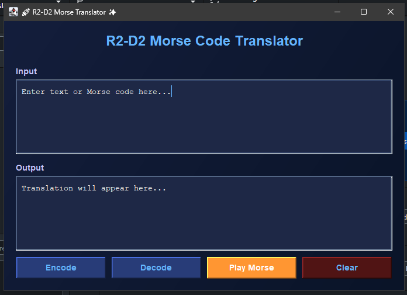
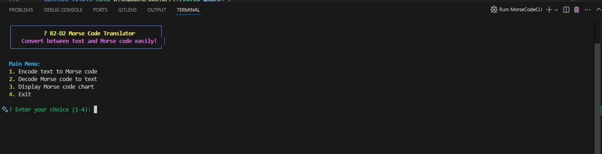

# 📡 R2-D2 Morse Code Translator ✨

A dual-interface Morse code translation tool with both graphical (GUI) and command-line (CLI) interfaces, featuring text-to-Morse and Morse-to-text conversion with audio playback capabilities.






## 🌟 Features

- **Dual Interface**:
  - 🖥️ Modern graphical interface (GUI)
  - ⌨️ Feature-rich command-line interface (CLI)
  
- **Translation**:
  - 🔤 Text → Morse code conversion
  - 🔄 Morse code → Text conversion
  - 📋 Built-in Morse code reference chart

- **Audio Playback**:
  - 🔊 Play Morse code as sound
  - ⏱️ Adjustable timing for dots/dashes
  - 🔉 Custom sound effects (R2-D2 inspired)

- **User Experience**:
  - 🎨 Colorful terminal output (CLI)
  - 🖱️ Interactive buttons with hover effects (GUI)
  - 📱 Responsive design for different screen sizes

## 📦 Project Structure
```
morse-translator/
│
├── src/
│ └── morse/
│ ├── MorseCodeCLI.java # Command-line interface
│ ├── MorseCodeGUI.java # Graphical interface
│ ├── MorseCodeMap.java # Morse code mappings
│ └── MorseCodeTranslator.java # Core translation logic
│
├── resources/
│ ├── dot.wav # Dot sound effect
│ └── dash.wav # Dash sound effect
│
├── out/ # Compiled class files
│
├── CLI.png # CLI screenshot
├── GUI.png # GUI screenshot
├── LICENSE # Project license
└── README.md # This file
```

## 🚀 Getting Started

### Prerequisites
- Java JDK 17 or later
- For audio playback in GUI: Sound system compatible with Java Sound API

### Installation
1. Clone the repository:
   ```bash
   git clone https://github.com/yourusername/morse-translator.git
   ```
2. Navigate to the project directory:
   ```
   cd morse-translator
   ```
## GUI Features
- Modern Dark Theme with space-inspired color scheme

- Real-time Translation between text and Morse code

- Audio Playback with customizable timing

- Interactive Elements with hover effects

## CLI Features
- Colorful Terminal Output with ANSI colors

- Interactive Menus with clear navigation

- Morse Code Chart for quick reference

- Audio Simulation using system beeps

- Visual Playback showing dots (•) and dashes (—)

## 📜 License
This project is licensed under the MIT License - see the LICENSE file for details.
